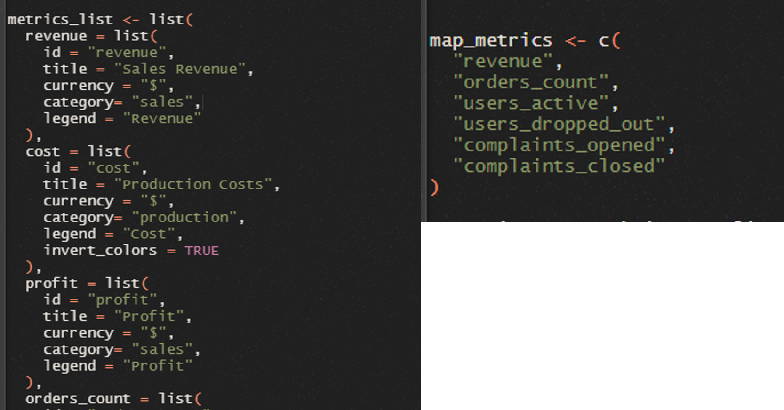
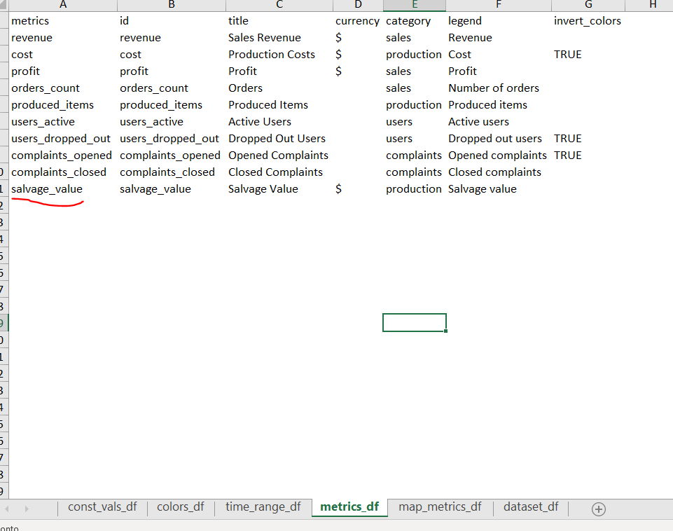
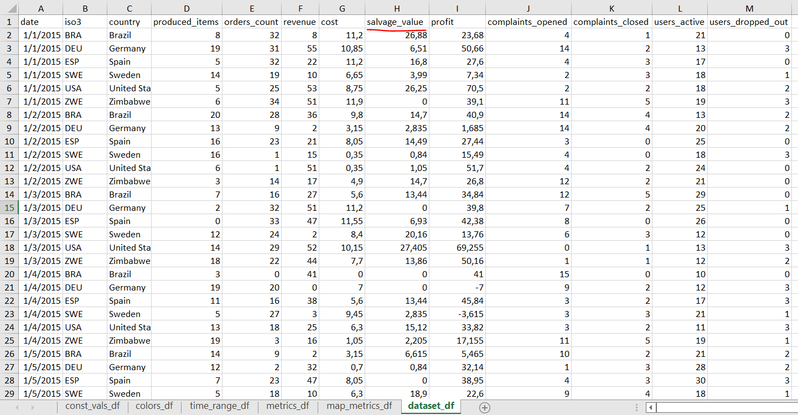
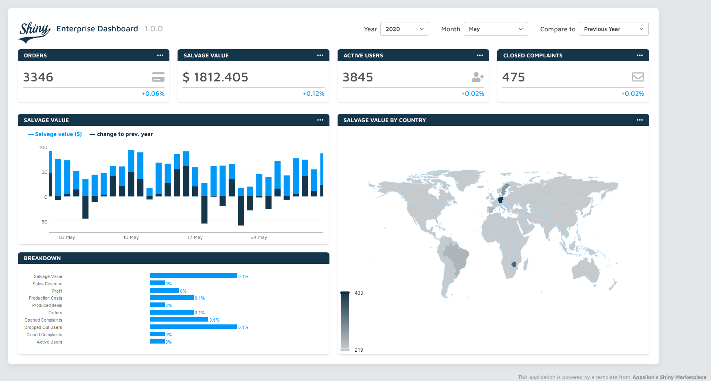

<!-- README.md is generated from README.Rmd. Please edit that file -->

```{r, include = FALSE}
knitr::opts_chunk$set(
  collapse = TRUE,
  comment = "#>"
)

library(nomnoml)
```

# Disclaimer

The project **Shiny Enterprise Dashboard** was created by [Appsilon](https://templates.appsilon.com/) and delivered to the community for free.

## What's new

### Project design

The beauty of this project is that it act as a complete template for designing shiny dashboards, the frontend and the backend of this application is template ready. Yet, the data set given is a bit hard to be prepared under a new project and therefore the creation of new metrics might be difficult do design.

For instance, if i want to create a new KPI and insert in this project then you'll have to:

1.  Adjust the `constants.R` file and create a new metric



2.  Update each data set with proper relationship of metrics. This part becomes exhaustive because each metric has another layer of complementary data facts, like:

```{r, eval=F}
fact_daily_metrics <- c("prev_month","change_prev_month","prev_year","change_prev_year")
fact_monthly_metrics <- c("perc_prev_month","perc_prev_year",)
fact_yearly_metrics <- c("perc_prev_year")
```

And each fact metric is based on the main metric you design.

Example:

orders_count on daily metrics has: `orders_count.prev_month, orders_count.change_prev_month, orders_count.prev_year and orders_count.change_prev_year`.


Since the project has 9 metrics and the daily_metrics fact has 4 calculations. That means that you'd have to give for the daily reference of metrics 45 columns with each value, and by adding any new metric you'd have to fulfill another 4 calculations on that data set.

Not to mention that each column must follow some rules to name.

**Considering the given project metrics:** You have 9 metrics with 4 data fact granularity (`countries_stats, daily_stats, monthly_stats and yearly_stats)` that have a set of calculations defined. That means you'd have to fulfill for the project **100 columns**.

### Adjustments made

In order to simplify this approach, a new data set was designed to simplify the creation of new metrics and update the data.

A spreadsheet was `data-raw/Dataset.xlsx` to be used as the template and it has the following sheets:

1.  **const_vals_df**: Used to update major information of the shiny dashboard like the app title, and marketplace website
2.  **colors_df:** Used to update the css of the map dashboard
3.  **time_range_df:** Relationship of time difference calculations
4.  **Metrics_df:** A simplified version of the metric_list



> A new metric has been created: savaged value

5.  **map_metrics_df**: A relationship of what metrics to be shown in the maps grid, the name of each metric must follow the same id of the metrics_df
6.  **dataset_df:** A unique dataframe with the fact containing only the metric value, the name of each metric must follow the same id of the metrics_df




> savaged_value is the new metric created and only increases the dataset by one column

### Application workflow

The project can be run from two workflows:

```
#direction: down
[Dataset.xlsx]->[renv::restore()]
[renv::restore()]->[dataset.R]
[dataset.R]->[shiny::run_app()]
[shiny::run_app()]->[publish to shinyapps]

[Dataset.xlsx]->[deploy.R]

```


## In what circumstances this might be a good application

It seems that this new layer on the application might be a good fit whenever you want to deploy a shiny dashboard with minor changes on the layout and also by uploading your own data and metrics.

In the example above, a new metric `savaged value` was created and rendered as a production layer to be shown in the map as well:




## Reproducibility of the changes

In order to check how the new data set template was created, there's a file on `data-raw/create_template.R` that uses the files from the project saved on `data-raw/old`

## To be done

- Dynamic changes of major Sass components
  - Layout colors
  - New metrics icons based on fontawesome information on the spreadsheet
- A flexible pipeline structure
  - pins
  - parquet
  - Databases
- A design of devops
  - git workflow
  - Docker file
  - tests

# Shiny Enterprise Dashboard

`ver. 1.0.0`

This is a template based on an html template and styled by Appsilon. This template contains multiple components (e.g., map, charts, KPIs). Each component is defined as a separate module which makes it easy to reuse. You can use them to build your own application. We added example data so you can run an example application after downloading the template.

We encourage you to try to add your own elements and style them based on the examples in the application!

Tech stack:

-   Shiny / htmlTemplate
-   Sass, CSS Grid

## Main changes

## Installation

---
- Make sure that you have [renv]("https://rstudio.github.io/renv/articles/renv.html) package installed
- Update the file ./data-raw/Dataset.xlsx
- Change the options of metrics and update with your own metrics
- Open the file ./dev/02_dev.R and follow its guideline
- While running the shiny application, click on the publish to shinyapps
---

## App folder structure

### **root directory**

The main part of the application is divided into 3 files located in the root directory: `global.R`, `ui.R`, and `server.R`. It helps organize the structure, especially in more complex apps. Any R objects that are created in the `global.R` file are available to the `ui.R` and `server.R` files.

Root directory also contains `constants.R` file with constant variables, where you can adjust items such as color values, text visible as labels or some reusable elements (e.g., logo).

### **data-raw**

Here you can find example data used in the application, it is a spreadsheet of name `Dataset.xlsx` that allows you to change any metric of this dashboard to a specific one of yours.

### **data**

Here you have an Rdata ready for the application, it is created from the **data-raw** pipeline, under the `dataset.R` file

### dev

It contains the pipeline to update the project data and deploy to rstudio.shinyapps.io, it is a helpful guide.

### devops

Contains the docker file and the github actions workflow. `To be designed`

### **modules**

Here you can find the `modules` composed of ui, init_server and server functions, managed by modules R package. This is a place where you can add new components or modify existing ones.

### **utilities**

Here you can store helper R functions used across the entire app.

### **styles**

This folder contains `scss` files with UI styling. All the sass files imported to `main.scss` are compiled into a single css file in `www` directory by [sass](%22https://rstudio.github.io/sass/index.html%22) package, every time you run the app. Sass files are initially divided into `config` and `partials`. If you add or remove some file, you need to import or remove it from `main.scss` as well.

### **www**

This folder contains the `css` file compiled from Sass files, `html` file template and `assets` folder with graphics.

### **renv**

Here you can find the `renv` package configuration folder. This package manager is necessary to install all dependencies used in this application.

## UI Components

-   headers with `SVG` logos

-   styled `filters`

-   `metrics` displaying dynamic values based on the dropdowns selection

-   map created with `echarts4r` package

-   vertical bar chart created with `ggplot2` package

-   horizontal bar chart created with `dygraphs` package

-   footer with the link to `Appsilon's Shiny Marketplace` - (Please do not remove this.)
