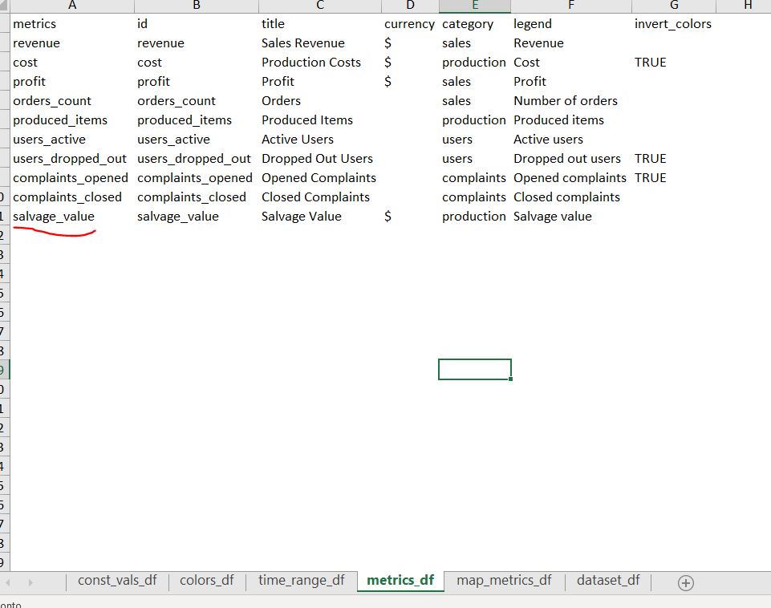
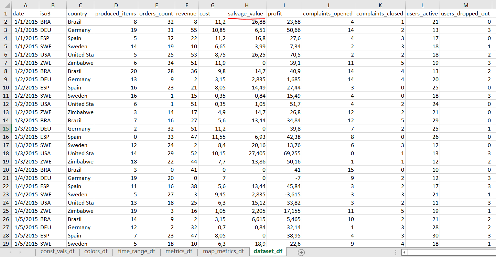

<!-- README.md is generated from README.Rmd. Please edit that file -->

# Disclaimer

The project **Shiny Enterprise Dashboard** was created by
[Appsilon](https://templates.appsilon.com/) and delivered to the
community for free.

## What’s new

### Project design

The beauty of this project is that it act as a complete template for
designing shiny dashboards, the frontend and the backend of this
application is template ready. Yet, the dataset given is a bit hard to
be prepared under a new project and therefore the creation of new
metrics might be difficult do design.

### Adjustments made

In order to simplify this approach, a new dataset was designed to
simplify the creation of new metrics and update the data.

A spreadsheet was `data-raw/Dataset.xlsx` to be used as the template and
it has the following sheets:

1.  **const_vals_df**: Used to update major information of the shiny
    dashboard like the app title, and marketplace website
2.  **colors_df:** Used to update the css of the map dashboard
3.  **time_range_df:** Relationship of time difference calculations
4.  **Metrics_df:** A simplified version of the metric_list

> A new metric has been created: salvage value

5.  **map_metrics_df**: A relationship of what metrics to be shown in
    the maps grid, the name of each metric must follow the same id of
    the metrics_df
6.  **dataset_df:** A unique dataframe with the fact containing only the
    metric value, the name of each metric must follow the same id of the
    metrics_df

> salvage_value is the new metric created and only increases the dataset
> by one column

### Application workflow

In order to replicate this project, you can run by two ways:

## In what circumstances this might be a good application

It seems that this new layer on the application might be a good fit
whenever you want to deploy a shiny dashboard with minor changes on the
layout and also by uploading your own data and metrics.

In the example above, a new metric `salvage value` was created and
rendered as a production layer to be shown in the map as well:

## Reproducibility of the changes

If you want to know how the previous version of the dataset was designed
and what changes were done in order to create this template, there’s a
file on `data-raw/create_template.R` that uses the files from the
project saved on `data-raw/old` that reproduces all the changes.

## To be done

-   Dynamic changes of major Sass components
    -   Layout colors
    -   New metrics icons based on fontawesome information on the
        spreadsheet
-   A flexible pipeline structure
    -   pins
    -   parquet
    -   Databases
-   A design of devops
    -   git workflow
    -   Docker file
    -   tests
